<div align="center">

# 👋 Mitya Kurs — Portfolio & CV

**A fast, prerendered personal portfolio** — _introduce · showcase · share_

[](https://github.com/mitekk/portfolio/actions/workflows/deploy.yml)
[](LICENSE)


A small, fast personal site that introduces who I am, walks through my experience and toolbox,
and lets you read or download my CV. Every route is **prerendered to static HTML**, so it loads
instantly and shares cleanly on LinkedIn and in search results — tuned for performance,
accessibility, and SEO, with the numbers gated in CI by Lighthouse.

Live at **[profile.mitya.dev](https://profile.mitya.dev/)**.

</div>

---

- **For developers** — [What it is](#what-it-is) · [Quick start](#quick-start) · [Architecture](#architecture) · [Tech stack](#tech-stack) · [Scripts](#scripts) · [Testing](#testing) · [CI](#continuous-integration) · [Deployment](#deployment) · [Docs](#docs--decisions)

---

## What it is

A personal portfolio and CV site. The landing page opens with an animated grid background and a
typing intro; from there, **About**, **Experience**, and **Toolbox** sections introduce my
background, and a dedicated `/cv` page renders an inline PDF preview with a download link and a
branded share card. It's deliberately small and fast — single-page React, prerendered to static
HTML, with per-route SEO metadata so each page shares cleanly.

## Quick start

```bash
npm install
npm run dev        # Vite dev server on http://localhost:5173
```

| Command | URL | Notes |
|---|---|---|
| `npm run dev` | <http://localhost:5173> | hot-reloading dev server |
| `npm run build` | — | type-check, build, then prerender routes to static HTML |
| `npm run preview` | <http://localhost:4173> | preview the production build locally |

> **Requirements:** Node **22** (matches the Dockerfile and CI). No runtime configuration — the
> site is fully static once built.

## Architecture

A single-page React app built by Vite, then **prerendered** to static HTML per route by
`react-snap` (the `postbuild` step). The static `dist/` is served by Nginx in a Docker image; no
server runtime, no API. Per-route `<head>` metadata is set with `react-helmet-async` from a
single SEO config (`src/seo/config.ts`).

```mermaid
flowchart LR
  Dev["Vite dev :5173"]
  Build["vite build"]
  Snap["react-snap<br/>prerender per route"]
  Dist[("dist/ · static HTML")]
  Nginx["Nginx (Docker)<br/>profile.mitya.dev"]
  Build --> Snap --> Dist --> Nginx
```



```
.
├── src/
│   ├── pages/         # intro · theBuzz (about · experience · toolbox) · cv · notFound
│   ├── components/    # UI · animated grid backgrounds · navbar · prompter · SEO head
│   ├── seo/           # single-source SEO config + structured data
│   ├── routes.tsx     # route table (lazy-loaded for bundle splitting)
│   └── main.tsx       # app entry
├── scripts/           # prerender.cjs (postbuild) · og-image.cjs
├── tests/             # Playwright e2e: flows · content · accessibility · layout
├── public/            # CV PDF, share cards, icons, robots.txt, sitemap.xml
├── docs/              # performance baseline + working specs/plans
├── nginx.conf         # production serving (caching, inline CV)
└── Dockerfile         # build → static → Nginx image
```

## Tech stack

| Layer | Tech |
|---|---|
| UI | React 19 · React Router 7 · `react-helmet-async` (per-route meta) |
| Styling | Tailwind CSS 4 · `@fontsource/poppins` |
| Build | Vite 6 · TypeScript 5 · `react-snap` (static prerender) |
| Tests | Vitest 4 (unit) · Playwright (e2e) · Testing Library |
| Quality | ESLint · Prettier · Husky · Lighthouse CI |
| Serving | Nginx · Docker · Node 22 |

## Scripts

| Command | What it does |
|---|---|
| `npm run dev` | Start the Vite dev server |
| `npm run build` | Type-check, build, and prerender routes to static HTML |
| `npm run preview` | Preview the production build locally |
| `npm run lint` | Run ESLint |
| `npm run format` | Format with Prettier (`format:check` to verify) |
| `npm run test:unit` | Run unit tests (Vitest) |
| `npm run test:e2e` | Run end-to-end tests (Playwright) |
| `npm run test` | Run unit and e2e tests |
| `npm run lhci` | Build and run Lighthouse CI |

## Testing

```bash
npm run test:unit   # Vitest unit tests (jsdom + Testing Library)
npm run test:e2e    # Playwright e2e against the dev server (auto-started)
npm run test        # both
```

Playwright drives the real app on `http://localhost:5173` (it boots `npm run dev` itself) and
covers the intro flow, navigation and routing, content/SEO presence, keyboard accessibility, and
responsive layout — see [`tests/`](tests/).

## Continuous integration

GitHub Actions ([`.github/workflows/deploy.yml`](.github/workflows/deploy.yml)) runs on every push
to `master` and on pull requests, in parallel jobs:

- **quality** — `npm ci`, ESLint, and Prettier `format:check`.
- **build** — full `npm run build` (type-check + Vite + prerender).
- **unit-tests** / **e2e-tests** — Vitest and Playwright, each uploading JUnit results (and the
  Playwright HTML report) as artifacts.
- **test-report** — aggregates the JUnit artifacts into a single test summary.

Lighthouse CI gates performance, accessibility, best-practices, and SEO scores — see
[`lighthouserc.json`](lighthouserc.json) and the recorded baseline in
[`docs/performance-baseline.md`](docs/performance-baseline.md).

## Deployment

`npm run build` outputs prerendered static HTML to `dist/`. The [`Dockerfile`](Dockerfile) builds
that in a `node:22-alpine` stage and serves it from `nginx:alpine` using
[`nginx.conf`](nginx.conf) (gzip, long-lived asset caching, the CV served inline). Deployed to
**[profile.mitya.dev](https://profile.mitya.dev/)**.

## Docs & decisions

- **Performance baseline:** [`docs/performance-baseline.md`](docs/performance-baseline.md) — Lighthouse scores + the CI gates that lock them in.
- **Design specs &amp; plans:** [`docs/superpowers/`](docs/superpowers/) — working notes for the responsive UI, intro overlay, theming, Lighthouse setup, and testing layer.

## License

Released under the MIT License — see [LICENSE](LICENSE).
